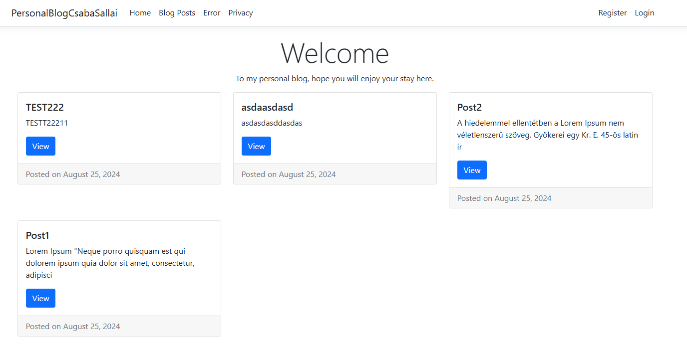
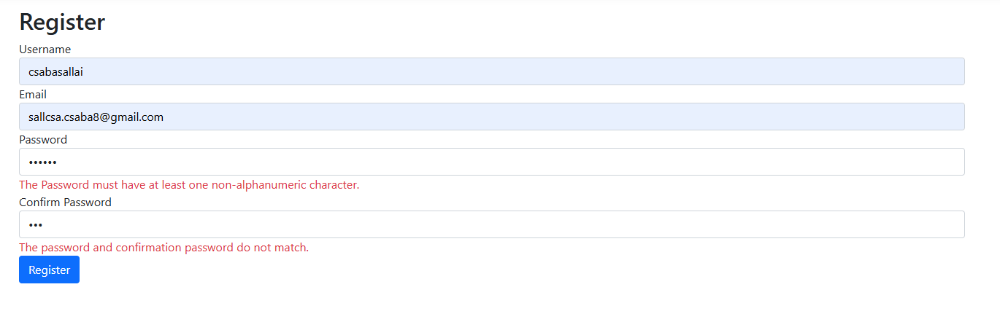
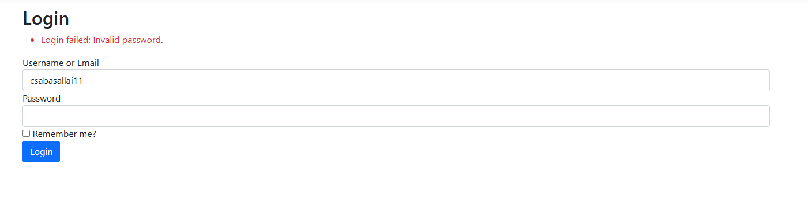
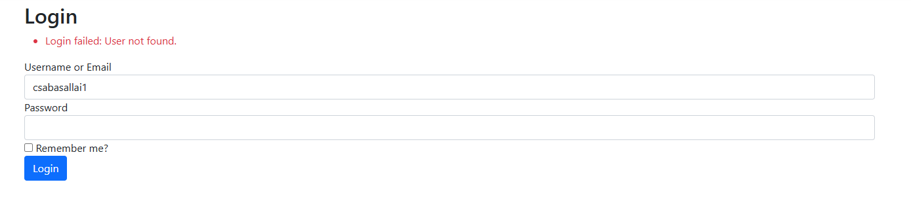
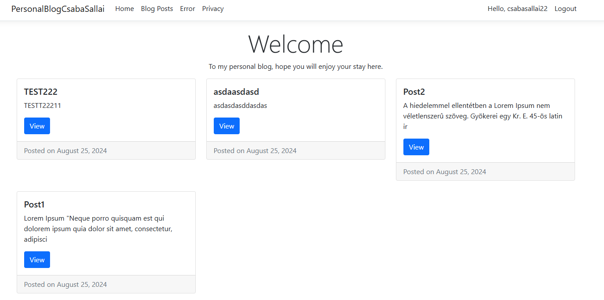
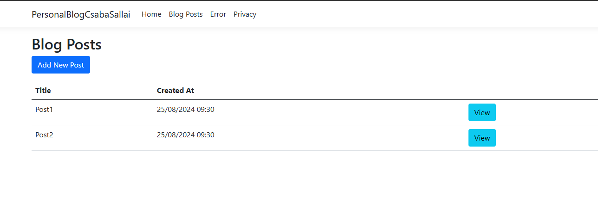
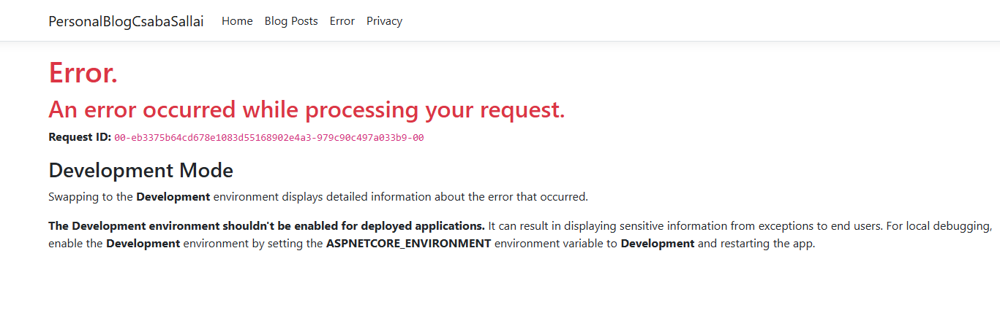
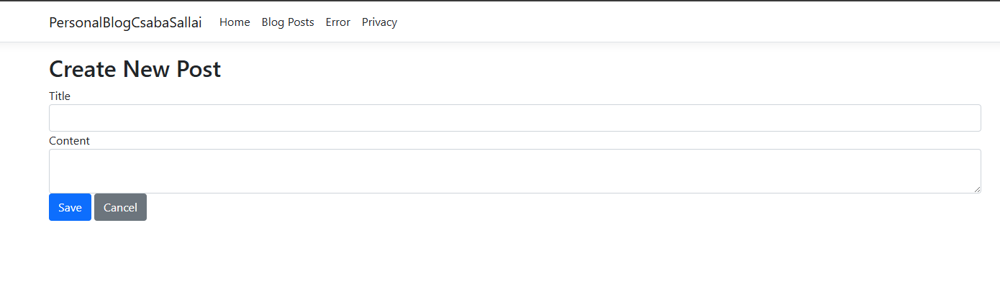
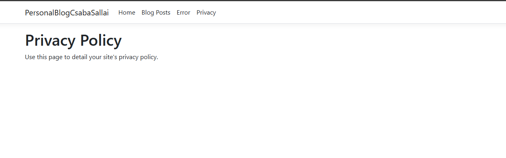
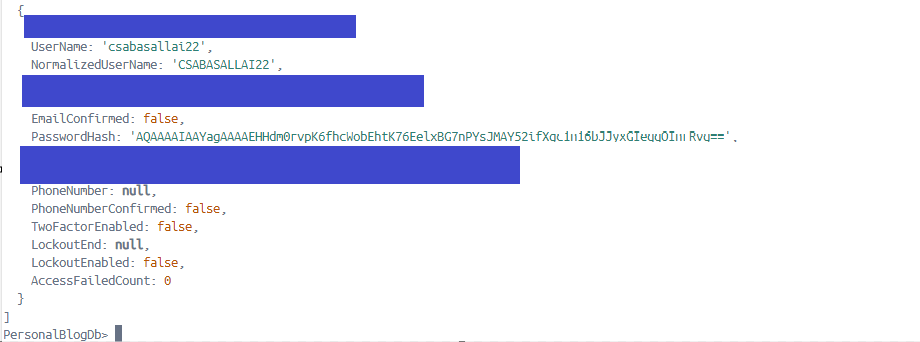

# PersonalBlogCsabaSallai

## Table of Contents
- [Screenshots](#screenshots)
- [Features](#features)
- [Technologies Used](#technologies-used)
- [Getting Started](#getting-started)
  - [Prerequisites](#prerequisites)
  - [Installation](#installation)
  - [Running the Application](#running-the-application)
- [Usage](#usage)
  - [Creating a Blog Post](#creating-a-blog-post)
  - [Viewing Blog Posts](#viewing-blog-posts)
  - [Searching Blog Posts](#searching-blog-posts)
- [Project Structure](#project-structure)

## Screenshots

## 1. screen - Welcome page


## 2. screen - Register page


## 3. screen - Login page


## 4. screen - Login page p2


## 5. screen - Already logged in state


## 6. screen - Post view


## 7.screen - Dummy Error Message


## 8.screen - Post creation


## 9.screen - Privacy Page


## 10.screen - MongoDB Query about the registered user



**PersonalBlogCsabaSallai** is a modern, scalable personal blog application built with ASP.NET Core, MongoDB, and Elasticsearch. This project showcases how to create, manage, and search blog posts using the latest web technologies.

## Features

- **Blog Post Management**: Create, edit, and view blog posts.
- **Full-Text Search**: Powered by Elasticsearch, allowing users to search blog posts quickly.
- **Modern Web Technologies**: Built with ASP.NET Core, MongoDB, and Docker for a full-stack development experience.
- **Scalable**: Designed to scale with the addition of containers and cloud services.

## Technologies Used

- **ASP.NET Core**: Web framework for building modern web applications.
- **MongoDB**: NoSQL database for storing blog posts.
- **Elasticsearch**: Search engine for full-text search functionality.
- **Docker**: Containerization of the application for easy deployment and environment management.
- **Bootstrap**: CSS framework for responsive and mobile-first design.

## Getting Started

### Prerequisites

Before you begin, ensure you have the following installed on your machine:

- [.NET SDK 8.0+](https://dotnet.microsoft.com/download/dotnet)
- [Docker](https://www.docker.com/get-started)
- [MongoDB](https://www.mongodb.com/try/download/community) (optional if not using Docker)
- [Elasticsearch](https://www.elastic.co/downloads/elasticsearch) (optional if not using Docker)

### Installation

1. **Clone the repository:**
    ```bash
    git clone https://github.com/csabika98/PersonalBlogCsabaSallai.git
    cd PersonalBlogCsabaSallai
    ```

2. **Restore dependencies:**
    ```bash
    dotnet restore
    ```
3. **Build the project:**
    ```bash
    dotnet build
    ```

### Running the Application
You can run the application either locally or using Docker.

1. **<b>Running Locally</b>:** TODO (Extend this section)
- Install both MongoDB & and ES & Start (if not using Docker):
2. **<b>Running with Docker</b>**
- TODO

## Usage (TODO)
### Creating a Blog Post 
### Viewing Blog Posts
### Searching Blog Posts


## Project Structure

<b> MVP </b>

```bash
/DevelopmentEnvironment
├── Dockerfile
├── docker-compose.yml
/src
├── Controllers
│   └── PostController.cs
├── Models
│   └── Post.cs
├── Properties
│   └── launchSettings.json
├── Screenshots
│   ├── 1.png
│   ├── 2.png
│   ├── 3.png
│   ├── 4.png
│   ├── 5.png
├── Services
│   ├── MongoDbContext.cs
│   ├── PostService.cs
│   └── ViewLocatorService.cs
├── Views
│   ├── Home
│   │   ├── Error.cshtml
│   │   ├── Index.cshtml
│   │   └── Privacy.cshtml
│   ├── Post
│   │   ├── Create.cshtml
│   │   ├── Details.cshtml
│   │   └── Index.cshtml
│   └── Shared
│       ├── _Layout.cshtml
│       ├── _Layout.cshtml.css
│       └── _ValidationScriptsPartial.cshtml
├── Program.cs
└── appsettings.json
```
